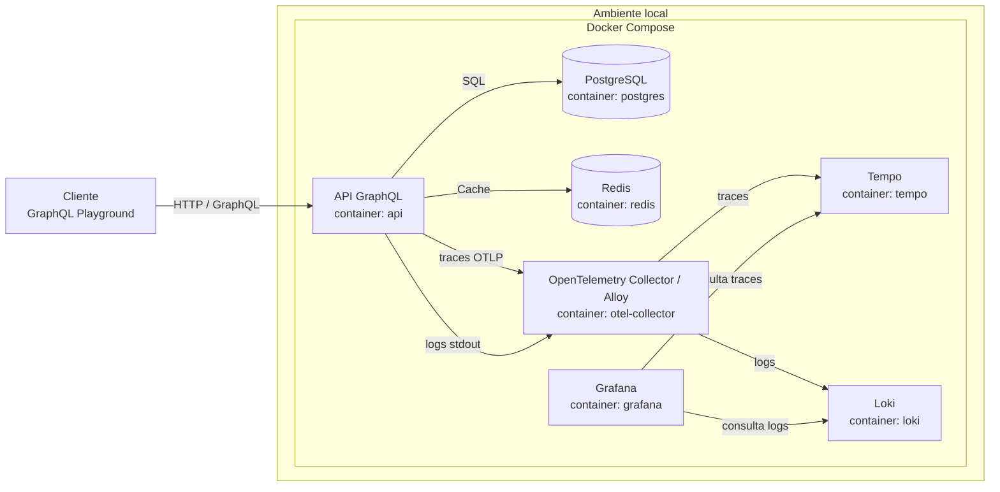
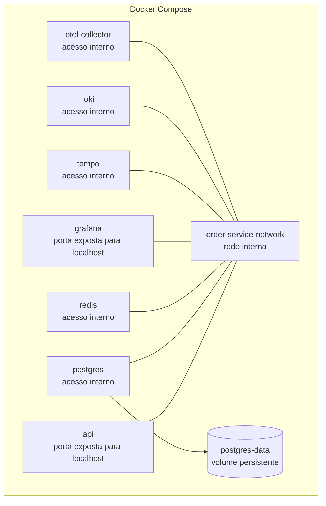

# 01 - System Design MVP

## Objetivo

Definir a arquitetura técnica inicial do sistema em um formato simples, claro e independente de linguagem.

Este documento descreve apenas o ferramental e a organização dos componentes do MVP.

Regras de negócio, modelagem de dados, schema GraphQL e casos de teste devem ficar em specs separadas.

## Arquitetura MVP

## Camadas

### Docker

O Docker Compose será usado para subir todos os serviços necessários para executar o projeto localmente.

Serviços previstos:

- API
- PostgreSQL
- Redis
- Grafana
- Tempo
- Loki
- OpenTelemetry Collector ou Grafana Alloy

Essa escolha reduz o esforço de configuração local e torna o ambiente mais previsível para desenvolvimento e execução.

### Rede Interna

Os serviços do Docker Compose devem compartilhar uma rede interna.

Somente API e Grafana precisam expor portas para a máquina local. PostgreSQL, Redis, Tempo, Loki e Collector podem ficar acessíveis apenas dentro da rede do Compose.

Exemplo de exposição:

- API: exposta para acesso local.
- Grafana: exposto para visualização local.
- PostgreSQL: acesso interno pela API.
- Redis: acesso interno pela API.
- Tempo: acesso interno pelo Collector e pelo Grafana.
- Loki: acesso interno pelo Collector e pelo Grafana.
- Collector: acesso interno pela API.

### API GraphQL

A API será a camada de entrada da aplicação.

Responsabilidades:

- Expor queries e mutations GraphQL.
- Concentrar a comunicação com os serviços internos.
- Conectar com PostgreSQL.
- Conectar com Redis.
- Expor endpoint de health check.
- Emitir logs estruturados quando possível.

A implementação pode ser feita em qualquer linguagem, mas a escolha inicial do projeto será Node.js com NestJS.

### PostgreSQL

O PostgreSQL será o banco relacional do MVP.

Responsabilidades técnicas:

- Persistir dados transacionais da aplicação.
- Executar dentro de um container.
- Usar volume para preservar dados localmente.
- Ser acessado pela API via rede interna do Docker Compose.

Detalhes de modelagem serão definidos em uma spec separada.

### Redis

O Redis será o cache do MVP.

Responsabilidades técnicas:

- Armazenar dados temporários.
- Reduzir leituras repetidas no banco.
- Executar dentro de um container.
- Ser acessado pela API via rede interna do Docker Compose.

Estratégias específicas de cache serão definidas em outra spec.

### Observabilidade

A stack de observabilidade será executada no Docker Compose para permitir investigar requests, erros e comportamento interno das features durante o desenvolvimento.

Serviços previstos:

- `grafana`: interface para visualizar logs e traces.
- `tempo`: armazenamento de traces distribuídos.
- `loki`: armazenamento de logs.
- `otel-collector` ou `alloy`: coletor responsável por receber sinais da API e encaminhar para Tempo e Loki.

Responsabilidades:

- Coletar traces gerados pela API.
- Coletar logs emitidos pela API.
- Permitir correlação entre request, logs e spans.
- Facilitar investigação de falhas por feature.

A observabilidade não deve fazer parte do caminho crítico de criação de pedidos. Se a stack de observabilidade estiver indisponível, a API deve continuar funcionando.

Padrões de logs, traces, spans e correlação serão definidos em spec própria:

- `docs/specs/09-observability-logs-traces.md`

## Visão dos Containers

## Configuração Esperada

O ambiente local deve ser iniciado com Docker Compose.

Componentes esperados:

- `api`: aplicação GraphQL.
- `postgres`: banco de dados relacional.
- `redis`: cache.
- `grafana`: visualização de logs e traces.
- `tempo`: backend de traces.
- `loki`: backend de logs.
- `otel-collector`: coletor de traces e logs.
- `postgres-data`: volume para persistência do banco.
- `order-service-network`: rede interna entre os containers.

Variáveis de configuração devem ser lidas pelo ambiente de execução, sem depender de dados sensíveis versionados.

## Observabilidade Inicial

Para o MVP, a observabilidade deve permitir acompanhar o fluxo de uma requisição e entender onde uma falha aconteceu.

Stack prevista:

- Grafana para visualização.
- Tempo para traces.
- Loki para logs.
- OpenTelemetry Collector ou Grafana Alloy para coleta.
- OpenTelemetry na API para gerar traces e spans.

Pontos observados:

- entrada da requisição;
- operação GraphQL executada;
- validação de input;
- use case chamado;
- consultas ao PostgreSQL;
- uso de Redis;
- sucesso ou falha da operação;
- código de erro retornado.

Requisitos mínimos:

- Logs no stdout da aplicação, preferencialmente com `requestId` ou `correlationId`.
- Traces exportados via OTLP.
- Health check da API.
- Health check dos containers no Docker Compose.
- Mensagens de erro padronizadas na API.

## Trade-offs do MVP

Este MVP não terá:

- Kubernetes.
- Elasticsearch.
- CDN.
- Load balancer externo.
- Mensageria.
- Workers assíncronos.
- Réplicas de banco.
- Observabilidade avançada.
- Secret manager.
- Service mesh.

Esses pontos podem ser descritos no README como melhorias futuras.

## Melhorias Futuras

Em um cenário mais robusto, o sistema poderia evoluir para:

- Executar em Kubernetes.
- Usar Ingress ou API Gateway.
- Adicionar Elasticsearch para busca avançada de produtos.
- Adicionar mensageria para processamento assíncrono.
- Criar worker para indexação e eventos.
- Usar réplicas de leitura no PostgreSQL.
- Adicionar métricas, logs estruturados e tracing distribuído.
- Configurar autoscaling da API.
- Adicionar CDN/WAF para proteção e performance na borda.
- Usar secret manager para credenciais.
- Separar ambientes de desenvolvimento, homologação e produção.
