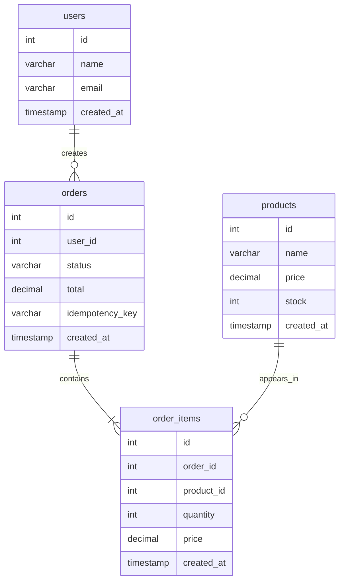

# 03 - Modelagem de Dados

## Objetivo

Definir a estrutura inicial do banco de dados relacional usando PostgreSQL como fonte da verdade.

Esta spec cobre apenas:

- Entidades.
- Tabelas.
- Campos.
- Relacionamentos.
- Constraints.
- Índices.
- Decisões de modelagem.

Fluxo de criação de pedidos, validações de aplicação e regras transacionais serão detalhados em specs separadas.

## Entidades

O modelo inicial terá quatro entidades principais:

- `users`
- `products`
- `orders`
- `order_items`

## Relacionamentos



## Tabela `users`

Representa os usuários que podem realizar pedidos.

Campos:

- `id`: identificador único.
- `name`: nome do usuário.
- `email`: email do usuário.
- `created_at`: data de criação do registro.

Constraints:

- `id` deve ser chave primária.
- `name` é obrigatório.
- `email` é obrigatório.
- `email` deve ser único.

Índices:

- índice único em `email`.

## Tabela `products`

Representa os produtos disponíveis para compra.

Campos:

- `id`: identificador único.
- `name`: nome do produto.
- `price`: preço atual do produto.
- `stock`: quantidade disponível em estoque.
- `created_at`: data de criação do registro.

Constraints:

- `id` deve ser chave primária.
- `name` é obrigatório.
- `price` deve ser maior que zero.
- `stock` deve ser maior ou igual a zero.

## Tabela `orders`

Representa um pedido feito por um usuário.

Campos:

- `id`: identificador único.
- `user_id`: referência ao usuário que realizou o pedido.
- `status`: estado atual do pedido.
- `total`: valor total do pedido.
- `idempotency_key`: chave opcional para evitar duplicidade em retentativas.
- `created_at`: data de criação do registro.

Constraints:

- `id` deve ser chave primária.
- `user_id` é obrigatório.
- `user_id` deve referenciar `users.id`.
- `status` é obrigatório.
- `total` deve ser maior ou igual a zero.
- `idempotency_key` deve ser único quando informado.

Status previstos:

- `CONFIRMED`: pedido criado com sucesso.
- `REJECTED`: pedido rejeitado por regra de negócio.

Índices:

- índice em `user_id`.
- índice único em `idempotency_key`.

## Tabela `order_items`

Representa os produtos de um pedido.

Campos:

- `id`: identificador único.
- `order_id`: referência ao pedido.
- `product_id`: referência ao produto.
- `quantity`: quantidade comprada.
- `price`: preço unitário do produto no momento do pedido.
- `created_at`: data de criação do registro.

Constraints:

- `id` deve ser chave primária.
- `order_id` é obrigatório.
- `order_id` deve referenciar `orders.id`.
- `product_id` é obrigatório.
- `product_id` deve referenciar `products.id`.
- `quantity` deve ser maior que zero.
- `price` deve ser maior que zero.

Índices:

- índice em `order_id`.
- índice em `product_id`.

## SQL Inicial

```sql
CREATE TABLE users (
    id SERIAL PRIMARY KEY,
    name VARCHAR(100) NOT NULL,
    email VARCHAR(100) NOT NULL UNIQUE,
    created_at TIMESTAMP NOT NULL DEFAULT NOW()
);

CREATE TABLE products (
    id SERIAL PRIMARY KEY,
    name VARCHAR(100) NOT NULL,
    price DECIMAL(10,2) NOT NULL CHECK (price > 0),
    stock INT NOT NULL CHECK (stock >= 0),
    created_at TIMESTAMP NOT NULL DEFAULT NOW()
);

CREATE TABLE orders (
    id SERIAL PRIMARY KEY,
    user_id INT NOT NULL REFERENCES users(id),
    status VARCHAR(30) NOT NULL,
    total DECIMAL(10,2) NOT NULL CHECK (total >= 0),
    idempotency_key VARCHAR(100) UNIQUE,
    created_at TIMESTAMP NOT NULL DEFAULT NOW()
);

CREATE TABLE order_items (
    id SERIAL PRIMARY KEY,
    order_id INT NOT NULL REFERENCES orders(id),
    product_id INT NOT NULL REFERENCES products(id),
    quantity INT NOT NULL CHECK (quantity > 0),
    price DECIMAL(10,2) NOT NULL CHECK (price > 0),
    created_at TIMESTAMP NOT NULL DEFAULT NOW()
);

CREATE INDEX idx_orders_user_id ON orders(user_id);
CREATE INDEX idx_order_items_order_id ON order_items(order_id);
CREATE INDEX idx_order_items_product_id ON order_items(product_id);
```

## Decisões

- Usar PostgreSQL como fonte da verdade.
- Manter o modelo relacional simples.
- Salvar o preço do produto em `order_items.price` para preservar o histórico do pedido.
- Adicionar `orders.status` para representar o estado do pedido.
- Adicionar `orders.idempotency_key` para reduzir risco de pedidos duplicados em retentativas.
- Usar constraints no banco para proteger invariantes básicas.
- Usar índices nos relacionamentos mais consultados.

## Fora do Escopo Inicial

O modelo inicial não terá:

- Endereço de entrega.
- Pagamentos.
- Cupons.
- Cancelamento de pedido.
- Histórico de alteração de estoque.
- Tabela de eventos.
- Auditoria completa.
