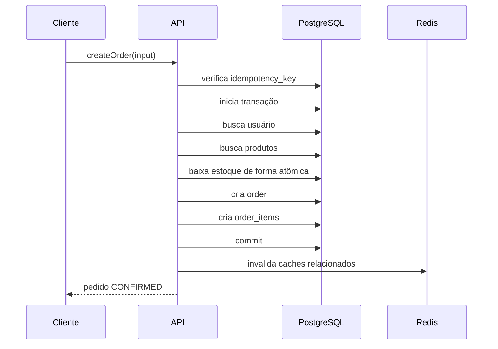

# 05 - Regras de Negócio e Transações

## Objetivo

Definir as regras de negócio do MVP e as garantias necessárias para preservar consistência dos pedidos.

Esta spec cobre:

- Cadastro de usuários.
- Cadastro de produtos.
- Criação de pedidos.
- Controle de estoque.
- Transações.
- Idempotência.
- Tratamento de falhas de negócio.

## Princípios

- PostgreSQL é a fonte da verdade.
- Redis não participa da confirmação de pedidos.
- A API só retorna sucesso para um pedido depois do commit no banco.
- Operações críticas devem ser transacionais.
- Regras de negócio devem ficar nos use cases, não nos resolvers.
- Repositórios devem expor operações explícitas para os use cases.

## Criar Usuário

Regras:

- `name` é obrigatório.
- `email` é obrigatório.
- `email` deve ter formato válido.
- `email` não pode estar em uso.

Resultado esperado:

- Criar um novo usuário.
- Retornar o usuário criado.

Erros previstos:

- `VALIDATION_ERROR`
- `USER_EMAIL_ALREADY_EXISTS`

## Criar Produto

Regras:

- `name` é obrigatório.
- `price` deve ser maior que zero.
- `stock` deve ser maior ou igual a zero.

Resultado esperado:

- Criar um novo produto.
- Retornar o produto criado.

Erros previstos:

- `VALIDATION_ERROR`

## Criar Pedido

Regras:

- `userId` deve referenciar um usuário existente.
- O pedido deve conter pelo menos um item.
- Cada item deve referenciar um produto existente.
- `quantity` deve ser maior que zero.
- Cada produto deve ter estoque suficiente.
- O total deve ser calculado pela aplicação usando o preço atual dos produtos.
- O preço unitário deve ser gravado em `order_items.price`.
- O estoque deve ser reduzido na mesma transação da criação do pedido.
- Se qualquer etapa falhar, nenhuma alteração parcial deve ser persistida.

Resultado esperado:

- Criar o pedido.
- Criar os itens.
- Reduzir o estoque.
- Retornar o pedido criado com status `CONFIRMED`.

Erros previstos:

- `VALIDATION_ERROR`
- `USER_NOT_FOUND`
- `PRODUCT_NOT_FOUND`
- `INSUFFICIENT_STOCK`
- `ORDER_ALREADY_PROCESSED`

## Fluxo Transacional do Pedido



## Baixa Atômica de Estoque

A baixa de estoque deve ser feita com uma condição que impeça estoque negativo.

Exemplo:

```sql
UPDATE products
SET stock = stock - $quantity
WHERE id = $productId
AND stock >= $quantity;
```

Se nenhuma linha for atualizada, o produto não tem estoque suficiente.

Nesse caso:

- a transação deve ser revertida;
- o pedido não deve ser confirmado;
- a API deve retornar `INSUFFICIENT_STOCK`.

## Idempotência

A criação de pedidos pode receber `idempotencyKey`.

Objetivo:

- Evitar pedido duplicado quando o cliente repetir a mesma requisição por timeout ou falha de rede.

Regra:

- Se já existir pedido com a mesma `idempotency_key`, retornar o pedido existente.
- Se a chave ainda não existir, processar normalmente.

Constraint esperada:

```sql
UNIQUE (idempotency_key)
```

Observação:

- A chave deve ser opcional no MVP.
- Quando enviada, deve ser tratada como identificador da intenção de criação do pedido.

## Falhas e Rollback

Situações que devem gerar rollback:

- Usuário inexistente.
- Produto inexistente.
- Estoque insuficiente.
- Erro ao criar pedido.
- Erro ao criar itens.
- Erro ao reduzir estoque.

O sistema não deve deixar:

- estoque reduzido sem pedido;
- pedido criado sem itens;
- pedido confirmado sem baixa de estoque;
- itens criados sem pedido correspondente.

## Redis Fora do Caminho Crítico

Redis pode ser usado para cache de leitura, mas não deve ser necessário para confirmar pedidos.

Regras:

- Falha no Redis não deve impedir criação de pedido.
- Pedido confirmado deve estar persistido no PostgreSQL.
- Cache deve ser invalidado após sucesso no banco.
- Se a invalidação falhar, a aplicação deve registrar log e seguir com a resposta do pedido.

## Decisões

- Criar pedidos dentro de transação.
- Controlar estoque no PostgreSQL.
- Usar update condicional para evitar estoque negativo em concorrência.
- Salvar preço histórico do item no momento do pedido.
- Usar idempotência para reduzir risco de duplicidade.
- Manter Redis fora do fluxo crítico de escrita.
- Centralizar regras em use cases.
