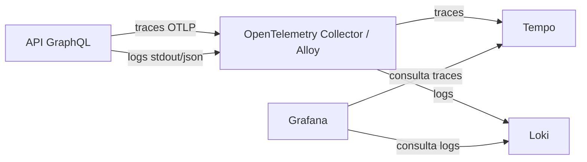

# 09 - Observabilidade, Logs e Traces

## Objetivo

Definir como a aplicação deve gerar logs, traces e informações de diagnóstico.

Esta spec cobre:

- Stack de observabilidade.
- Padrão de logs.
- Padrão de traces.
- Uso de `requestId` e `correlationId`.
- Spans por camada da aplicação.
- Observabilidade de erros.
- Observabilidade por feature.
- O que não deve ser logado.

## Stack

Componentes previstos:

- Grafana para visualização.
- Tempo para armazenamento de traces.
- Loki para armazenamento de logs.
- OpenTelemetry Collector ou Grafana Alloy para coleta.
- OpenTelemetry SDK na API.

Fluxo:



## Princípios

- Observabilidade não deve bloquear fluxo de negócio.
- Falha no coletor, Tempo, Loki ou Grafana não deve derrubar a API.
- Logs devem ajudar investigação sem expor dados sensíveis.
- Traces devem mostrar o caminho de uma requisição dentro da aplicação.
- Erros devem carregar contexto suficiente para diagnóstico.
- Cada request deve ter um identificador rastreável.

## Identificadores

Cada requisição deve ter:

- `requestId`: identifica a requisição dentro da API.
- `correlationId`: identifica o fluxo entre sistemas, quando enviado pelo cliente ou gerado pela API.

Regras:

- Se o cliente enviar `x-correlation-id`, a API deve reaproveitar esse valor.
- Se não vier `x-correlation-id`, a API deve gerar um novo.
- `requestId` pode ser sempre gerado pela API.
- Ambos devem aparecer nos logs.
- O `correlationId` deve ser adicionado como atributo nos spans.

Headers sugeridos:

```txt
x-request-id
x-correlation-id
```

## Padrão de Logs

Logs devem ser estruturados em JSON sempre que possível.

Campos mínimos:

```json
{
  "timestamp": "2026-01-01T10:00:00.000Z",
  "level": "info",
  "message": "create order started",
  "service": "order-service",
  "requestId": "req-123",
  "correlationId": "corr-456",
  "feature": "orders",
  "operation": "createOrder"
}
```

Níveis:

- `debug`: detalhes úteis em desenvolvimento.
- `info`: fluxo esperado da aplicação.
- `warn`: falha recuperável ou comportamento esperado, mas relevante.
- `error`: falha inesperada ou erro interno.

## O Que Logar

Eventos importantes:

- entrada da requisição;
- operação GraphQL chamada;
- início e fim do use case;
- validação rejeitada;
- erro de negócio;
- erro inesperado;
- início e fim de transação;
- falha de banco;
- falha de cache;
- cache hit;
- cache miss;
- invalidação de cache;
- duração de operação crítica.

## O Que Não Logar

Não logar:

- senhas;
- tokens;
- headers de autenticação;
- dados sensíveis;
- payload completo sem necessidade;
- stack trace em resposta para o cliente;
- valores de `.env`;
- informações pessoais além do necessário para diagnóstico.

Para pedidos, evitar logar payload completo. Preferir:

```txt
userId
orderId
productIds
itemsCount
status
errorCode
```

## Padrão de Traces

Cada requisição GraphQL deve gerar um trace.

O trace deve mostrar:

- entrada da requisição;
- resolver chamado;
- validação;
- use case;
- chamadas a repositórios;
- transação;
- chamadas ao PostgreSQL;
- chamadas ao Redis;
- resposta ou erro.

Nome do trace:

```txt
GraphQL <operationName>
```

Exemplos:

```txt
GraphQL createOrder
GraphQL createUser
GraphQL products
```

## Spans Recomendados

### Entrada GraphQL

Span:

```txt
graphql.request
```

Atributos:

```txt
graphql.operation.name
graphql.operation.type
request.id
correlation.id
```

### Validação

Span:

```txt
validation.zod
```

Atributos:

```txt
validation.schema
validation.success
validation.error_count
```

### Use Case

Span:

```txt
usecase.create_order
```

Atributos:

```txt
feature
operation
user.id
items.count
```

### Banco de Dados

Spans:

```txt
db.transaction
db.query
db.update_stock
db.create_order
db.create_order_items
```

Atributos:

```txt
db.system
db.operation
db.table
db.transaction.status
```

Não incluir SQL completo com dados sensíveis.

### Redis

Spans:

```txt
redis.get
redis.set
redis.invalidate
```

Atributos:

```txt
cache.key
cache.hit
cache.ttl
```

Evitar incluir chaves com dados sensíveis.

## Trace de `createOrder`

Fluxo esperado:

```txt
GraphQL createOrder
  -> graphql.request
  -> validation.zod
  -> usecase.create_order
  -> repository.find_user
  -> repository.find_products
  -> db.transaction
    -> db.update_stock
    -> db.create_order
    -> db.create_order_items
  -> redis.invalidate
  -> response.success
```

Fluxo com erro de estoque:

```txt
GraphQL createOrder
  -> graphql.request
  -> validation.zod
  -> usecase.create_order
  -> repository.find_products
  -> db.transaction
    -> db.update_stock
    -> business_error.insufficient_stock
    -> db.rollback
  -> response.error
```

## Observabilidade de Erros

Erros devem aparecer em logs e traces.

Para erro de negócio:

- log em `warn`;
- span com status de erro controlado;
- `error.code` preenchido;
- sem stack trace em resposta ao cliente.

Exemplo:

```json
{
  "level": "warn",
  "message": "order rejected by insufficient stock",
  "feature": "orders",
  "operation": "createOrder",
  "errorCode": "INSUFFICIENT_STOCK",
  "requestId": "req-123",
  "correlationId": "corr-456"
}
```

Para erro inesperado:

- log em `error`;
- stack trace apenas no log interno;
- span com status de erro;
- resposta GraphQL com código genérico.

## Observabilidade por Feature

### Users

Operações:

- `createUser`
- `users`

Logs úteis:

- usuário criado;
- email duplicado;
- erro de validação.

Spans úteis:

- `usecase.create_user`
- `repository.create_user`
- `repository.find_user_by_email`

### Products

Operações:

- `createProduct`
- `products`

Logs úteis:

- produto criado;
- cache hit;
- cache miss;
- cache invalidado;
- erro de validação.

Spans úteis:

- `usecase.create_product`
- `usecase.list_products`
- `repository.create_product`
- `repository.list_products`
- `redis.get`
- `redis.set`

### Orders

Operações:

- `createOrder`
- `order`

Logs úteis:

- pedido iniciado;
- pedido confirmado;
- pedido rejeitado;
- estoque insuficiente;
- idempotência reutilizada;
- rollback executado.

Spans úteis:

- `usecase.create_order`
- `repository.find_order_by_idempotency_key`
- `repository.find_products`
- `db.transaction`
- `db.update_stock`
- `db.create_order`
- `db.create_order_items`

## Métricas Derivadas

Mesmo que métricas completas fiquem para uma evolução futura, logs e traces devem permitir observar:

- duração de requests;
- duração de use cases;
- taxa de erro por operação;
- frequência de `INSUFFICIENT_STOCK`;
- cache hit/miss;
- tempo de queries;
- tempo de transações.

## Configuração

Variáveis previstas:

```txt
OTEL_SERVICE_NAME=order-service
OTEL_EXPORTER_OTLP_ENDPOINT=http://otel-collector:4318/v1/traces
OTEL_TRACES_ENABLED=true
LOG_LEVEL=info
```

## Decisões

- Usar OpenTelemetry para traces.
- Usar logs estruturados no stdout.
- Usar Grafana para visualização.
- Usar Tempo para traces.
- Usar Loki para logs.
- Usar Collector ou Alloy como ponte entre API e backends de observabilidade.
- Correlacionar logs e traces por `requestId` e `correlationId`.
- Não deixar observabilidade bloquear fluxo de negócio.
- Não logar dados sensíveis.
